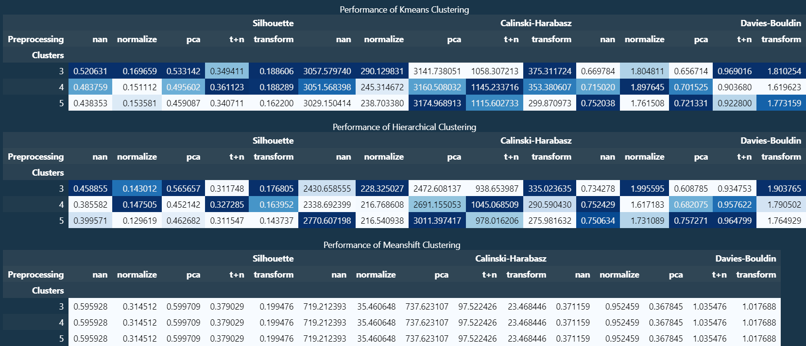
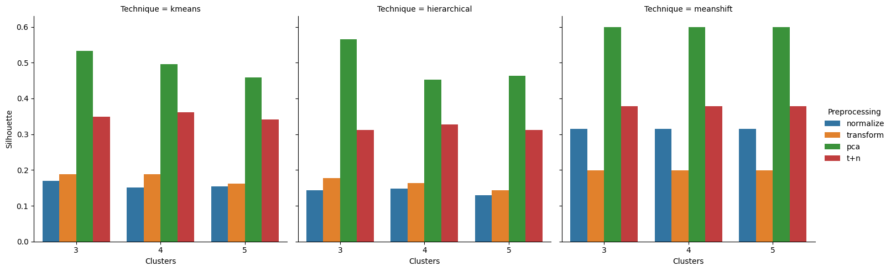

# Clustering Analysis on UCI Wine Quality Dataset



## 📊 Project Overview
This project presents a comparative analysis of different clustering algorithms on the UCI Wine Quality dataset. The primary objective is to evaluate how various clustering techniques and preprocessing methods impact clustering performance. Each clustering technique (K-Means, Hierarchical, and K-Means Shift) is applied with multiple data preprocessing methods, and the results are assessed using **Silhouette Score**, **Calinski-Harabasz Index**, and **Davies-Bouldin Index**.

## 📝 Dataset
I used the **Wine Quality** dataset from the UCI Machine Learning Repository. The dataset consists of various physicochemical properties of wine, with each sample characterized by features like alcohol content, pH level, and acidity. **No target column** was chosen, as this is an unsupervised clustering analysis.

**Dataset Features:**
- Age
- Workclass
- Education
- Marital Status
- Occupation
- ...and more

## 📈 Methodology
1. **Preprocessing**: 
   - Applied several preprocessing techniques including **Normalization**, **Transformation**, and **PCA**.
   - Additionally, combined transformations such as **Transform + Normalize (T+N)** and **Transform + Normalize + PCA (T+N+PCA)**.
   
2. **Clustering Techniques**:
   - **K-Means Clustering**: Performed clustering with different cluster sizes (c=3, 4, 5).
   - **Hierarchical Clustering**: Applied with various linkage criteria to identify optimal groupings.
   - **K-Means Shift Clustering**: Evaluated performance with bandwidth adjustments.

3. **Evaluation Metrics**:
   - **Silhouette Score**: Measures the cohesion and separation of clusters.
   - **Calinski-Harabasz Index**: Evaluates the dispersion between clusters.
   - **Davies-Bouldin Index**: Assesses the average similarity ratio of each cluster with its most similar one.

## 🚀 How to Run the Code
1. Clone this repository:
   ```bash
   git clone https://github.com/sidharthd7/Clustering.git
   ```
2. Install the required dependencies:
   ```bash
   pip install -r requirements.txt
   ```
3. Run the Jupyter Notebook in your VS Code environment:
   ```bash
   jupyter notebook
   ```

4. Make sure to have the `winequality.csv` file in the `data` folder:
   ```bash
   └── project_root/
       ├── data/
       │   └── winequality.csv
       ├── notebooks/
       │   └── main.ipynb
       ├── README.md
       ├── requirements.txt
       └── ...
   ```

## 💻 Results

### 1️⃣ Clustering Performance Table
Here's the summary of the clustering performance metrics across different algorithms, preprocessing methods, and cluster sizes:


### 2️⃣ Visual Analysis
To gain more insight into the distribution and separation of clusters, here’s a visual representation of the clusters post-application of PCA and K-Means:



### 3️⃣ Observations
- **K-Means** with **PCA** preprocessing shows superior performance with the highest **Calinski-Harabasz** scores, indicating well-separated clusters.
- **Normalization** enhances the **Davies-Bouldin Index** for most algorithms, implying improved compactness.
- The **Hierarchical Clustering** method generally performed well with minimal preprocessing, showing stability across different metrics.

## 📚 Conclusion
This project demonstrates the impact of different clustering techniques and preprocessing methods on clustering quality. **K-Means Clustering with PCA** preprocessing consistently outperformed other methods, making it the most effective approach for this dataset. This analysis provides insights into how data preprocessing and choice of clustering algorithm can influence the quality and interpretability of clusters in unsupervised learning tasks.

---